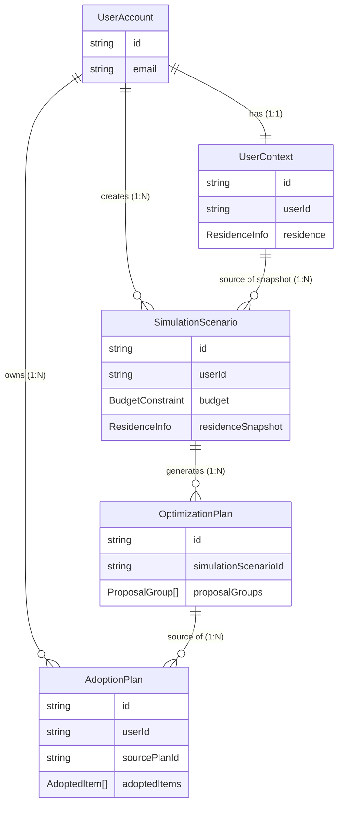

# データモデリング (Draft)

MVP.mdの要件に基づき、NoSQL (Document DB想定) とDDDを意識した初期エンティティ定義を作成します。

## ドメインコンテキスト図 (概略)



1.  **ユーザーコンテキスト (User Context)**
    *   ユーザーの現状（住環境、ライフスタイル、悩み）を管理する。
2.  **製品カタログコンテキスト (Catalog Context)**
    *   IoT家電等の製品情報を管理する。
3.  **提案コンテキスト (Recommendation Context)**
    *   ユーザー情報と製品情報を掛け合わせ、最適な構成とROI、導入ロードマップを生成・保持する。
4.  **実行・追跡コンテキスト (Execution Context)**
    *   提案の中から「これをやる」と決めた計画（採用プラン）と、その進捗（購入ステータス）を管理する。

---

## 1. ユーザーコンテキスト (User Context)

認証、属性、および診断セッション（シミュレーション）を管理します。変更頻度の異なるデータを分離しました。

### Entity: `UserAccount` (Aggregate Root)
認証・識別情報。最も静的。
```typescript
type UserAccount = {
  id: string;
  email: string;
  passwordHash: string; // 実際の実装ではFirebase Auth等に委譲する可能性あり
  createdAt: Date;
};
```

### Entity: `UserContext`
ユーザーの「取り巻く環境」。住居などは頻繁には変わらないため、別管理とします。
```typescript
type UserContext = {
  id: string; // UserAccount IDと1:1、または独自ID
  userId: string;
  residence: ResidenceInfo; // 住環境 (変更頻度: 低)
  updatedAt: Date;
};
```

### Entity: `SimulationScenario` (Aggregate Root)
1回の診断・提案の単位。名前を「シミュレーションシナリオ」とし、
「ある予算と条件におけるシミュレーション」であることを明確にしました。

**スナップショットパターン**: 診断実行時点での住環境情報を値として保持します。

```typescript
type SimulationScenario = {
  id: string;
  userId: string;
  status: 'draft' | 'completed';
  
  // このシナリオでの入力条件 (可変パラメーター)
  input: {
    budget: BudgetConstraint; // 予算
    chores: ChoreInput[];     // ペイン
    
    // 住環境スナップショット (不変の前提条件)
    residenceSnapshot: ResidenceInfo; 
  };

  // 生成された提案への参照
  planId?: string;
  
  createdAt: Date;
};
```

### Value Objects

```typescript
// 住環境プロファイリング
type ResidenceInfo = {
  type: 'rental' | 'owned'; 
  buildingType: 'apartment' | 'house';
  features: string[]; 
  constraints: {
    hasSteps: boolean;
    floorTypes: ('flooring' | 'tatami' | 'carpet')[];
    hasWifi: boolean;
  };
};

// 家事負担入力
type ChoreInput = {
  category: 'cleaning' | 'laundry' | 'cooking' | 'security' | 'other';
  timeSpentPerWeek: number;
  frequencyPerWeek: number;
  painLevel: 1 | 2 | 3 | 4 | 5; 
  painReason: string;
};

// 予算設定
type BudgetConstraint = {
  amount: number;
  type: 'total_initial' | 'monthly_allowance';
};
```

---

## 2. 製品カタログコンテキスト (Catalog Context)

製品選定のための参照用データ。リードヘビーなため、検索最適化を考慮。

### Entity: `Product` (Aggregate Root)

```typescript
// 製品情報 (必要最小限に簡略化)
type Product = {
  id: string;
  name: string;
  manufacturer: string;
  strongPoint: string;
  weakPoint: string;
  category: 'robot_vacuum' | 'smart_lock' | 'dishwasher' | 'lighting' | 'sensor' | 'hub' | 'other';
  price: number; // 概算価格
  
  // 設置難易度 (MVP要件: 設置難易度を考慮)
  installationDifficulty: 'low' | 'medium' | 'high';

  // 購入導線
  purchaseLink: string;
  
  // 表示用画像
  imageUrl?: string;
};
```

---

## 3. 提案コンテキスト (Recommendation Context)

本サービスのコア価値。LLMが生成した結果を構造化して保存する。

### Entity: `OptimizationPlan` (Aggregate Root)
シミュレーションシナリオに基づいて生成された最終的な提案プラン。
従来のフラットなアイテムリストではなく、**課題カテゴリ（ジャンル）ごとの提案グループ**として構造化します。
また、特定の課題解決ではないがシステム全体に必要なハブ等は「基盤・管理 (management)」カテゴリとして扱います。

```typescript
type OptimizationPlan = {
  id: string;
  userId: string;
  simulationScenarioId: string; // どのシミュレーションに対する回答か
  createdAt: Date;

  // 提案内容プロパティ
  concept: string; 

  // 提案グループ (掃除、洗濯、基盤などでグルーピング)
  proposalGroups: ProposalGroup[];

  // ROI計算結果
  roiProjection: {
    totalInitialCost: number;
    estimatedTimeSavedYearly: number; // 時間/年
    roiScore: number;
    mentalImpact: string;
  };
};
```

### Value Objects

```typescript
type ProposalGroup = {
  // ペインのカテゴリ + システム基盤(management)
  category: 'cleaning' | 'laundry' | 'cooking' | 'security' | 'management' | 'other';
  priority: number; // ユーザーのペインレベルに基づく表示順位 (1が最優先)
  description: string; // このグループでの解決方針 („床掃除を完全自動化し...“)
  items: ProposedItem[];
};

type ProposedItem = {
  productId: string;
  quantity: number; // 個数 (電球やスイッチbot用)
  reason: string; // なぜこの商品か
};
```

---

## 4. 実行・追跡コンテキスト (Execution Context)

提案（OptimizationPlan）を見てユーザーが「採用」した、確定版の計画。
ここで「どれを買うか」を確定し、その後の購入ステータスを管理します。

### Entity: `AdoptionPlan` (Aggregate Root)
導入プロジェクトの実体。

```typescript
type AdoptionPlan = {
  id: string;
  userId: string;
  sourcePlanId: string; // 元になった提案プランID
  createdAt: Date;
  updatedAt: Date;

  // 採用したアイテムと進捗
  adoptedItems: AdoptedItem[];

  // 全体の進捗ステータス
  status: 'planning' | 'in_progress' | 'completed';
};
```

### Value Objects

```typescript
type AdoptedItem = {
  productId: string;
  quantity: number;
  
  // 購入・設置ステータス
  status: 'wont_do' | 'pending' | 'bought' | 'installed';
  
  // ユーザーメモ (「Amazonで購入済み」など)
  note?: string;
};
```
